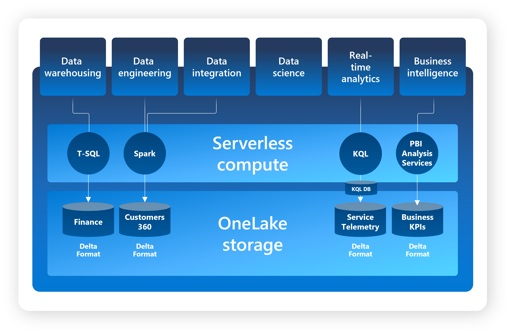

# AI Skills Challenge: Fabric Analytics Engineer
- Analytics Engineers connect, ingest, store, analyze, and report on data with Microsoft Fabric.

__1. Introduction to end-to-end analytics using Microsoft Fabric (MF)__
- Fabric provides a set of integrated services that enable you to ingest, store, process, and analyze data in a single environment.
- Fabric is a unified software-as-a-service (SaaS) offering, with all your data stored in a single open format in OneLake.

**OneLake**
- OneLake is Fabric's lake-centric architecture that provides a single, integrated environment for data professionals and the business to collaborate on data projects.
- A key component of OneLake that allows you to read data from a single copy, without moving or duplicating data.
    - Fabric's data warehousing, data engineering (Lakehouses and Notebooks), data integration (pipelines and dataflows), real-time analytics, and Power BI all use OneLake as their native store without needing any extra configuration.
- The default storage format for OneLake is Delta Parquet, which is an open-source storage layer that brings reliability to data lakes.
- Provides a comprehensive data analytics solution by unifying all these experiences on a single platform
    - Synapse Data Engineering: data engineering with a Spark platform for data transformation at scale.
    - Synapse Data Warehouse: data warehousing with industry-leading SQL performance and scale to support data use.
    - Synapse Data Science: data science with Azure Machine Learning and Spark for model training and execution tracking in a scalable environment.
    - Synapse Real-Time Analytics: real-time analytics to query and analyze large volumes of data in real-time.
    - Data Factory: data integration combining Power Query with the scale of Azure Data Factory to move and transform data.
    - Power BI: business intelligence for translating data to decisions.

- Fabric is built on Power BI and Azure Data Lake Storage, and includes capabilities from Azure Synapse Analytics, Azure Data Factory, Azure Databricks, and Azure Machine Learning.

__2. Get started with lake-houses in MF__
- A lakehouse is a unified platform that combines:
  - The flexible and scalable storage of a data lake
  - The ability to query and analyze data of a data warehouse
- Can use a lakehouse as the basis of an end-to-end data analytics solution that includes data ingestion, transformation, modeling, and visualization.
- A shortcut enables to include external (Azure Data Lake Store Gen2) data in the lakehouse.
- Data ingestion can also be automated using Data Factory Pipelines or Dataflows (Gen2).
  - Dataflows (Gen2) are based on Power Query. The familiar tool to data analysts using Excel or Power BI that provides visual representation of transformations as an alternative to traditional programming.
- Data Factory Pipelines can be used to orchestrate Spark, Dataflow, and other activities --> enabling to implement complex data transformation processes.
- After transforming the data, you can query it using SQL, use it to train machine learning models, perform real-time analytics, or develop reports in Power BI.
- [Hands-on Lab: Create and Ingest Data with Fabric Lakehouse](https://microsoftlearning.github.io/mslearn-fabric/Instructions/Labs/01-lakehouse.html)

__3. Use Apache Spark in MF__
- Apache Spark is an open source parallel processing framework for large-scale data processing and analytics.
- Spark uses a "divide and conquer" approach to processing large volumes of data quickly by distributing the work across multiple computers.
- In most scenarios, the default settings provide an optimal configuration for Spark in Microsoft Fabric.
- The Parquet format is typically preferred for data files that you will use for further analysis or ingestion into an analytical store.
- Partitioning is an optimization technique that enables Spark to maximize performance across the worker nodes. More performance gains can be achieved when filtering data in queries by eliminating unnecessary disk IO.
- The Spark catalog supports tables based on files in various formats:
  - The preferred format in MF is `delta`, which is the format for a relational data technology on Spark named Delta Lake.
- [Hands-on Lab: Analyze data with Apache Spark](https://microsoftlearning.github.io/mslearn-fabric/Instructions/Labs/02-analyze-spark.html)

__4. Work with Delta Lake tables in MF__
- Tables in a MF lakehouse are based on the Linux foundation Delta Lake table format.
- Delta Lake is an open-source storage layer for Spark that enables relational database capabilities for batch ans streaming data.
- Delta tables are schema abstractions over data files that are stored in Delta format. For each table, the lakehouse stores a folder containing Parquet data files and a _delta_Log folder in which transaction details are logged in JSON format.
- The benefits of using Delta tables:
  - Relational tables that support querying and data modification.
  - Support for ACID transactions
  - Data versioning and time travel
  - Support for batch and streaming data
  - Standard formats and interoperability.
- A typical stream processing solution involves constantly reading a stream of data from source, optionally processing it to select specific fields, aggregate and group values, or otherwise manipulate the data, and writing the results to a sink.
  - You could capture a stream of real time data from an IoT device and write the stream directly to a delta as a sink - enabling you to query the table to see the latest streamed data.
- [Hands-on Lab: Use delta tables in Apache Spark](https://microsoftlearning.github.io/mslearn-fabric/Instructions/Labs/03-delta-lake.html)

__5. Use Data Factory pipelines in MF__
- Data pipelines define a sequence of activities that orchestrate an overall process, usually by extracting data from one or more sources and loading it into a destination. Pipelines are commonly used to automate extract, transform, and load (ETL) processes that ingest transactional data from operational data stores into an analytical data store, such as a lakehouse or data warehouse.
- Activities: the executable tasks in a pipelines. You can define a flow of activities by connecting them in a sequence.
  - The outcome of a particular activity (success, failure, or completion) can be used to direct the flow to the next activity in the sequence.
  - Data transformation activities: encapsulate data transfer operations, including simple Copy Data activities that extract data from a source and load it to a destination, and more complex Data Flow activities that encapsulate dataflows (Gen2) that apply transformations to the data as it is transferred.
  - Control flow activities: you can use to implement loops, conditional branching, or manage variable and parameter values.
- Parameters: enabling you to provide specific values to be used each time a pipeline is run.
  - You might want to use a pipeline to save ingested data in a folder, but have the flexibility to specify a folder name each time the pipeline is run.
- Pipeline runs: A data pipeline run is initiated, runs can be initiated on-demand in the Fabric user interface or scheduled to start at a specific frequency.
  - Use the unique run ID to review run details to confirm they completed successfully and investigate the specific settings used for each execution.
- Use the `Copy Data` activity when you need to copy data directly between a supported source and destination without applying any transformations, or when you want to import the raw data and apply transformations in later pipeline activities.
- Use the `Data Flow` activity to run a dataflow (Gen2) to apply transformations to the data, or merge data from multiple sources.
- The run history details show the time taken for each activity (optionally as s Gantt chart)
- [Hands-on Lab: Ingest data with a pipeline](https://microsoftlearning.github.io/mslearn-fabric/Instructions/Labs/04-ingest-pipeline.html)

__6. Ingest Data with Dataflows Gen2__
- Dataflows Gen2 allow you to prepare the data to ensure consistency, and then stage the data in the preferred destination. They also enable reuse and make it easy to update the data.
- Data Factory and Power BI workloads allow Dataflow Gen2 creation
- `Dataflows` are a type of cloud-based ETL tool for building and executing scalable data transformation processes.
- `Dataflows Gen2` allow you to extract data from various sources, transform it using a wide range of transformation operations, and load i into a destination. Using Power Online also allows for a visual interface to perform these tasks.
- Dataflows can be horizontally partitioned as well. Once you create a global dataflow, data analysts can use dataflows to create specialized semantic models for specific needs.
- Limitations:
  - Not a replacement for a data warehouse
  - Row-level security isn't supported
  - Fabric capacity workspace is required.
- [Hands-on Lab: Create and use a Dataflow Gen2 in Microsoft Fabric](https://microsoftlearning.github.io/mslearn-fabric/Instructions/Labs/05-dataflows-gen2.html)
- Connect to Data Factory workload --> Create Dataflows Gen2 to transform data --> Create Data pipeline to include your dataflow and then land data to a KQL Database.
- Power Query Online offers a visual interface to perform complex data transformations without writing any code.

__7. Ingest data with Spark and MF notebooks__
- Fabric notebooks offer automation and a comprehensive solution for ingestion and transformation. Fabric notebooks use a Spark engine to allow a multithreaded, distributed transaction for speedy processes.
- Lakehouse support structured, semi-structured, and unstructured files and Delta tables. Optimize Delta table configuration for more performant reads and writes.
- While prior to Spark or notebook experience is helpful, it's not mandatory. They are the best choice if you: handle large external data and need complex transformations
- `V-Order` enables faster and more efficient reads by various compute engines, such as Power BI, SQL, and Spark. It applies special sorting, distribution, encoding, and compression on parquet files at write-time.
- `V-Order` and `Optimize Write` enhance Delta tables by sorting data and creating fewer, larger Parquet files.
- When you load data, it's good idea to do some basic cleaning like removing duplicates, handling errors, converting null vales, and getting rid of empty entries to ensure data quality and consistency.
- Data scientists usually prefer fewer changes so they can explore wide tables. The Power BI data analysts my require more transformation and modeling before they can use the data.
- [Hands-on Lab: Ingest data with Spark and Microsoft Fabric notebooks](https://microsoftlearning.github.io/mslearn-fabric/Instructions/Labs/10-ingest-notebooks.html)

__8. Organize Fabric Lakehouse using Medallion Architecture Design__
- The medallion architecture brings structure and efficiency to your lakehouse environment. It has become a standard across the industry for lakehouse-based analytics.

- The medallion architecture is recommended data design pattern used to organize data in a lakehouse logically. It aims to improve data quality as it moves through different layers.
- The architecture typically has three layers: bronze (raw), silver (validated), and gold (enriched), each representing higher data quality levels.
- Bronze layer: raw layer of the medallion architecture is the first layer of the lakehouse. It's the landing zone for all data, whether it's structured, semi-structured, or unstructured. The data is stored in its original format, and no changes are made to it.
  - Determine how you'll ingest data into your bronze layer. You can do this using pipelines, dataflows, or notebooks.
- Silver layer: validated layer is the second layer of the lakehouse. Typical activities in the silver layer include combining and merging data and enforcing data validation rules like removing nulls and deduplicating.
  - The silver layer can be thought of as a central repository across an organization or team, where data is stored in a consistent format and can be accessed by multiple teams.
  - Cleaning your data enough so that everything is in one place and ready to be refined and modeled in the gold layer.
- Gold layer: enriched layer is the third layer of the lakehouse. In the gold layer, data undergoes further refinement to align with specific business and analytics needs. This could involve aggregating data to a particular granularity, such as daily or hourly, or enriching it with external information.
  - It becomes ready for use by downstream teams, including analytics, data science, or MLOps.
  - You'll model your data for reporting using a dimensional model. You'll establish relationships, define measures, and incorporate any other elements essential for effective reporting.
  - Depending on your needs, you might also use a Data Warehouse as your gold layer.
- Notebooks are a more suitable tool for data transformation with big data in Fabric.
- There are a few things to consider when deciding how to move and transform data across layers:
  - How much data are you working with?
  - How complex are the transformations you need to make?
  - How often will you need to move data between layers?
  - What tools are you most comfortable with?
- Data orchestration refers to the coordination and management of multiple data-related processes, ensuring they work together to achieve a desired outcome. The primary tool for data orchestration in Fabric in _pipeline_.
  - Pipeline can be automated to run on a schedule or triggered by an event.
- Creating multiple Gold layers tailored for diverse audiences or domains highlights the flexibility of the medallion architecture. Finance, sales, data science – each can have its optimized Gold layer, serving specific analytical requirements.
- Secure lakehouse:
  - Security and Access Considerations: define who needs access at each layer, ensuring only authorized personnel can interact with sensitive data.
  - Restrict access to the Gold, Bronze layer for read-only purposes, emphasizing the importance of minimal permissions.
  -  Decide whether users will be allowed to build upon the Silver layer, balancing flexibility and security.
- Continuous Integration and Continuous Delivery (CI/CD)
  - CI/CD is crucial at the gold layer of a lakehouse because it ensures that high-quality, validated, and reliable data is available for consumption. Automated processes enable continuous integration of new data, data transformations, and updates, reducing manual errors and providing consistent and up-to-date insights to downstream users and applications. This enhances data accuracy, accelerates decision-making, and supports data-driven initiatives effectively.
- [Hands-on Lab: Organize your Fabric lakehouse using a medallion architecture](https://microsoftlearning.github.io/mslearn-fabric/Instructions/Labs/03b-medallion-lakehouse.html)

__9. Data Warehouses in MF__
- Relational data warehouses are at the center of most enterprise business intelligence (BI) solutions. While the specific details may vary across data warehouse implementations, a common pattern based on a denormalized, multidimensional schema has emerged as the standard design for a relational data warehouse.
- The process of building a modern data warehouse typically consists of:
  - Data ingestion: moving data from source systems into a data warehouse
  - Data storage: storing the data in a format that is optimized for analytics
  - Data processing: transforming the data into a format that is ready for consumption by analytical tools
  - Data analysis and delivery: analyzing the data to gain insights and delivering those insights to the business.
- Fabric's data warehouse is a relational data warehouse that supports the full transactional T-SQL capabilities. You can use SQL to query and analyze the data, or use Spark to process the data and create machine learning models.
- Tables in a data warehouse:
  - Typically organized in a way that supports efficient and effective analysis of large amounts of data.
  - _Fact tables_ contain the numerical data that you want to analyze. Fact tables typically have a large number of rows and are primary source of data for analysis. For example, a fact table might contain the total amount paid for sales orders that occurred on a specific date or at a particular store.
    - A fact table stores measurements, metrics or facts of business processes.
  - _Dimension tables_ contain descriptive information about the data in the fact tables. Dimension tables typically have a small number of rows and are used to provide context for the data in the fact tables. For example, a dimension table might contain information about the customers who placed sales orders.
    - A dimension table stores attributes used to group numeric measures.
  - A dimension table contains a unique key column that uniquely identifies each row in the table. In fact, it's common for a dimension table to include two key columns:
    - A surrogate key is a unique identifier for each row in the dimension table. It's often an integer value automatically generated by the database management system when a new row is inserted into the table.
    - An alternate key is often a natural or business key that identifies a specific instance of an entity in the transactional source system - such as a product code or a customer ID.
  - Time dimensions provide information about the time period in which an event occurred. For example, a time dimension might include columns for the year, quarter, month, and day in which a sales order was placed.
  - Slowly changing dimensions tables that track changes to dimension attributes over time, like changes to customer's address or a product's price. Slowly changing dimensions ensure that data stays up-to-date and accurate, which is imperative to make good business decisions.
- A data warehouse is organized as a star schema, in which a fact table is directly related to the dimension tables
- If there are lots of levels or some information is shared by different things, it might make sense to use a snowflake schema instead.
- A semantic model in the data warehouse experience provides a way to organize and structure data in a way that is meaningful to business users, enabling them to easily access and analyze data.
- Item permissions: by granting access to a single data warehouse using item permissions, you can enable downstream consumption of data.
- [Hands-on Lab: Analyze data in a data warehouse](https://microsoftlearning.github.io/mslearn-fabric/Instructions/Labs/06-data-warehouse.html)

__10. Load Data into MF Data Warehouse__
- Data warehouse in MF is powered up with Synapse Analytics by offering a rich set of features that make it easier to manage and analyze data.
- ETL pipeline in a data warehouse:
  - Data ingestion/extract is about moving raw data from various sources into a central repository.
  - Data loading involves taking the transformed or processed data and loading it into the final storage destination for analysis and reporting.
- Staging objects act as temporary storage and transformation areas.
  - Staging servers as an abstraction layer, simplifying and facilitating the load operation to the final tables in the data warehouse.
  - The Staging area provides a buffer that can help to minimize the impact of the load operation on the performance of the data warehouse.
- Data pipeline is the cloud-based service for data integration, which enables the creation of workflows for data movement and data transformation at scale. You can create and schedule data pipelines that can ingest and load data from disparate data stores. You can build complex ETL, or ELT processes that transform data visually with data flows.
  - Most of the functionality of data pipelines in Microsoft Fabric comes from Azure Data Factory, allowing for seamless integration and utilization of its features within the Microsoft Fabric ecosystem.
- The Warehouse is powered by the same SQL engine they're familiar with, enabling them to perform complex queries and data manipulations. These operations include filtering, sorting, aggregating, and joining data from different tables. The SQL engine’s wide range of functions and operators further allows for sophisticated data analysis and transformations at the database level.
- COPY (Transact-SQL) statement, date pipelines, dataflows, and cross-warehouse are the four data ingestion options available in MF for loading data into a data warehouse.
- The COPY (Transact-SQL) statement currently supports the PARQUET and CSV file formats, and Azure Data Lake Storage (ADLS) Gen2 and Azure Blob Storage as a data source.
- When working with external data on files, we recommend the files are at least 4MB in size.
- [Hands-on Lab: Load data into a warehouse in Microsoft Fabric](https://microsoftlearning.github.io/mslearn-fabric/Instructions/Labs/06a-data-warehouse-load.html)

__11. Use Tools to Optimize Power BI Performance__
- The [Performance analyzer](https://learn.microsoft.com/en-us/power-bi/create-reports/desktop-performance-analyzer) helps you understand how report elements like visuals and DAX queries are performing.
- The Performance analyzer helps you optimize at two of the four architecture levels, the data model and report visuals. The Performance analyzer is a great place to start when you're optimizing reports (investigating performance issues with visuals in a report).
- [DAX Studio](https://daxstudio.org/) is an open-source tool for executing DAX queries against Power BI and Analysis Services models. DAX Studio is useful for:
  - Reviewing the contents of your data model.
  - Writing and optimizing complex DAX formulas and queries.
- The Best Practice Analyzer (BPA) is a set of rules run in Tabular Editor that notify you of potential modeling missteps or changes that you can make to improve your model design and performance. It includes recommendations for naming, user experience, and common optimizations that you can apply to improve performance.
-  The Best Practice Analyzer in Tabular Editor can be run manually or automated to ensure all models adhere to best practices.
- [Hands-on Lab: Use tools to optimize Power BI performance](https://learn.microsoft.com/en-us/training/modules/use-tools-optimize-power-bi-performance/5-exercise)
- To optimize a slow report, you can run the Performance analyzer to measure how each of the report elements performs when users interact with them. From there, you can dig into DAX query performance in DAX Studio, where you can view, sort, and filter performance data. You can also troubleshoot single measures or queries and/or evaluate the overall performance of your data model. To design data models proactively, you can use the Best Practice Analyzer rules in Tabular Editor to implement data modeling best practices as you go.

__12. Create and Manage Power BI Deployment Pipeline__
- Pipelines enable a continuous integration/continuous deployment (CI/CD) approach that ensures content is updated, well-tested, and regularly refreshed and needed.
- Using deployment pipelines leads to less manual work and fewer errors.
- Development - design, review, and revise content in a development workspace
  - Engage other creators on new content
  - Use minimal semantic models. When it's ready to be tested and reviewed, deploy the content to the test stage.
- Test – test and verify that the content is accurate in this preproduction workspace.
  - Share content with testers and reviewers
  - Load and run tests with larger volumes of data
  - Test your app to see how it will look for your end users. When it’s ready to be distributed to your users, deploy the content to the production stage.
- Production – the workspace content has been tested and is ready to be consumed by your users either in an app or by access to the production workspace.
  - Share the final version of your content with business users across the organization
- [Create Deployment Pipeline](https://learn.microsoft.com/en-us/training/modules/power-bi-deployment-pipelines/create-deployment-pipeline) --> [Assign Workspace](https://learn.microsoft.com/en-us/training/modules/power-bi-deployment-pipelines/assign-workspace) --> [Deploy Content](https://learn.microsoft.com/en-us/training/modules/power-bi-deployment-pipelines/deploy-content)